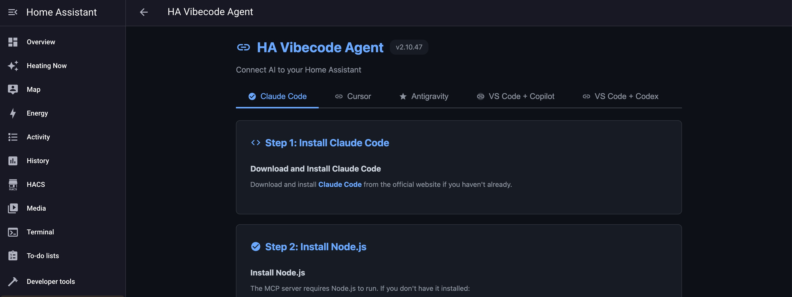

# HA Vibecode Agent

[](https://github.com/Coolver/home-assistant-vibecode-agent)
[](LICENSE)
[](https://www.npmjs.com/package/@coolver/home-assistant-mcp)
[](https://coolver.github.io/home-assistant-vibecode-agent/)

**Let AI build your Home Assistant automations – or act as your DevOps for the ones you write by hand. Just describe what you need in natural language. 🏠🤖**

You describe your goal → AI inspects your Home Assistant → designs a custom solution → and deploys it on-board automatically. 🚀

And if you prefer to handcraft your automations and scripts yourself, the agent can simply act as your DevOps and extra pair of hands: quickly uploading your changes, running tests, and analyzing logs on demand. **You stay in control and decide how much you delegate to AI and how deep it should go.**

Transform the way you manage your smart home. This agent enables **Claude Code**, **Cursor**, **Visual Studio Code (VS Code)**, or any **MCP-enabled IDE** to:

- 📝 Analyze your Home Assistant configuration, entities, and devices  
- 🏗️ Create intelligent automations, scripts, and complete systems — including Home Assistant helpers that can be fully managed programmatically  
- 🎨 Design and customize UI dashboards with full control over cards, layouts, and styling  
- 🖌️ Create and tweak themes for a personalized UI  
- 🔄 Safely deploy changes with automatic Git-based versioning  
- 🔍 Monitor and troubleshoot your setup through log analysis  
- 📦 Install and manage HACS integrations and custom repositories  

No more manual YAML editing or searching through documentation - just describe what you want in natural language!

**Real example:** User says *"Install smart climate control"* → AI analyzes 7 TRVs, creates 10 automations + 9 helpers + 10 sensors + 5 scripts, deploys everything, and it just works!

https://github.com/user-attachments/assets/0df48019-06c0-48dd-82ad-c7fe0734ddb3

**Full YouTube Demo:**
- [How to control Home Assistant from Cursor](https://youtu.be/xocbWonWdoc)

---

## 🎯 What is this?

**HA Vibecode Agent** is a service that exposes a safe REST API and toolset, allowing AI assistants (Claude Code, Cursor, VS Code, Antigravity, and any MCP-enabled IDE) to safely work *with* your Home Assistant instead of just generating YAML in the dark.

It supports two deployment modes:

| Mode | For whom | How it runs |
|------|----------|-------------|
| **Supervisor (Add-on)** | Home Assistant OS / Supervised | Installed via HA Add-on Store (default) |
| **Standalone (Docker)** | HA Container in Docker / Proxmox / NAS | Runs as a separate Docker container |

Both modes provide the same core functionality. The only difference: **Add-on management** (install/uninstall/restart add-ons) requires the Supervisor and is not available in standalone mode.

---

### 🚀 How is this different from other MCP modules for Home Assistant?

Most MCP integrations I've seen for Claude, Cursor, VS Code or Antigravity work only on your local machine and talk to Home Assistant over SSH and sometimes the REST API.

For serious Home Assistant work, that's not really enough:

Home Assistant is not just a bunch of YAML files.
It exposes multiple internal APIs, and some of the most important ones are only available from inside HA itself over the WebSocket API.

When you access HA only via SSH, the AI usually has to generate and upload a helper script on every request, then execute it blindly on the host.
Since that script can be different every time, each request is a bit of a black box — more like playing Russian roulette than doing reliable automation.

Because of that, I chose a different architecture.

This project is **split into two modules**:

**Home Assistant Agent** (this module) – runs inside (or alongside) Home Assistant,
has native access to all relevant APIs, files and services,
and exposes a safe, well-defined interface for external tools.

**Home Assistant MCP server** – runs on your computer alongside your AI IDE (Cursor, VS Code, etc.)
and talks to the Agent over a controlled API instead of SSH hacks (installation steps below)

This design makes working with Home Assistant faster, more predictable, safer and repeatable.
Your AI IDE gets exactly the actions and data it needs — through a stable API — instead of constantly inventing ad-hoc scripts and hoping they behave correctly.

---

## ⚡ Installation (5 minutes)

### Option A: Home Assistant Add-on (default, recommended)

**For users running Home Assistant OS or Supervised installation.**

This is the standard deployment — the agent runs as a managed add-on inside Home Assistant with full access to Supervisor API.

#### 1. Add Repository

Open your **Home Assistant UI** (usually http://homeassistant.local:8123):

1. Go to **Settings** → **Add-ons** → **Add-on Store** → **⋮** → **Repositories** (usually http://homeassistant.local:8123/hassio/dashboard )
2. Add: `https://github.com/coolver/home-assistant-vibecode-agent`
3. Click **Add**

#### 2. Install and Start Add-on

Still in **Home Assistant UI**:

1. Refresh the page
2. Find **HA Vibecode Agent** → Click **INSTALL**
3. Wait for installation to complete
4. Enable → **Start on boot: ON** → and push **START** button
5. **Wait for startup** (~10 seconds)
6. Click **"Open Web UI"** button

You'll see this interface:

<p align="center">
  
</p>

7. Click the **Cursor** or **VS Code** tab (depending on which IDE you want to use with Home Assistant) and **follow the setup instructions**. You'll need to install and configure Cursor or VS Code so they can connect to the HA Agent via the MCP protocol.

8. That's it — **you're ready to start** working with your Home Assistant scripts, automations and dashboards using AI.

If you find this project useful and want to support its development, **please consider giving it a [GitHub Star](https://github.com/Coolver/home-assistant-vibecode-agent) ⭐**

[YouTube Installation guide: how to install the Home Assistant Cursor Agent](https://youtu.be/RZNkNZnhMrc)

---

### Option B: Standalone Docker (Proxmox / Docker / NAS)

**For users running Home Assistant Container without Supervisor** (e.g., in Proxmox LXC/VM, Synology NAS, or plain Docker Compose).

The agent runs as a separate Docker container alongside your Home Assistant instance and connects via a Long-Lived Access Token.

#### Prerequisites

- Home Assistant running and accessible over the network
- **Long-Lived Access Token** — create one in HA UI: **Profile** (bottom-left) → **Long-Lived Access Tokens** → **Create Token**
- Docker and Docker Compose installed on the host

#### 1. Clone the repository

```bash
git clone https://github.com/Coolver/home-assistant-vibecode-agent.git
cd home-assistant-vibecode-agent
```

#### 2. Configure environment

```bash
cp .env.example .env
```

Edit `.env` with your values:

```env
HA_URL=http://192.168.1.100:8123
HA_TOKEN=your_long_lived_access_token_here
HA_CONFIG_PATH=/path/to/homeassistant/config
```

#### 3. Start the agent

```bash
docker compose -f docker-compose.standalone.yml up -d
```

#### 4. Get the API key

The agent auto-generates an API key on first start. View it in the logs:

```bash
docker compose -f docker-compose.standalone.yml logs | grep "API Key"
```

Or read it directly from the config directory:

```bash
cat /path/to/homeassistant/config/.ha_cursor_agent_key
```

#### 5. Configure your IDE

The agent is now available at `http://<host-ip>:8099`. Configure your MCP client (Cursor, VS Code, etc.) to connect using the API key from step 4.

---

## 🤖 Using with AI IDE (Cursor, VS Code etc)

This agent enables **AI IDE to autonomously manage your Home Assistant** through natural language - no manual copy-pasting needed!

### ⚠️ Important Disclaimer

**This tool is designed for experienced Home Assistant users who understand what they're doing.** 

- ✅ **Always review changes** before applying them to production systems
- ⚠️ **AI can accidentally break your configuration** if given incorrect instructions or outdated information
- 💾 **Git versioning is enabled by default** - all changes are backed up and can be rolled back
- 🔄 **Test in a safe environment first** if you're new to AI-driven automation
- 📖 **Verify syntax and compatibility** with your Home Assistant version

**Use at your own risk. The automatic backup system minimizes risk but doesn't eliminate it.**

### Start Using

Once connected, just describe what you want in natural language:

```
Show me all my climate entities and their current states
```

```
Analyze my automations and suggest optimizations
```

```
Create a smart lighting automation for movie mode
```

AI will autonomously read your configuration, create components, and deploy everything automatically!

**That's it!** AI IDE will use the MCP protocol to communicate with your Home Assistant.

**Learn more:** [MCP Home Assistant on GitHub](https://github.com/Coolver/home-assistant-mcp) | [NPM Package](https://www.npmjs.com/package/@coolver/home-assistant-mcp)

### Real-World Examples

**Build Smart Climate Control:**
```
Install a smart climate control system for my TRV radiators. 
Analyze my current devices, create automations for efficient heating 
with predictive shutdown, buffer radiators, and adaptive cooldowns.
Set up monitoring sensors and dashboard.
```

**AI will autonomously:**
- Detect all your TRV entities by analyzing Home Assistant
- Create 10+ automations for intelligent heating control
- Add 9 input helpers for system state management
- Generate 10 template sensors for monitoring
- Create 5 scripts for boiler and buffer control
- Build Lovelace dashboard with all metrics
- Test and deploy everything
- **All tailored to YOUR specific TRVs and configuration!**

**Optimize Existing System:**
```
My heating wastes energy. Analyze my current climate automations 
and optimize for efficiency while maintaining comfort.
```

**Debug Issues:**
```
My bedroom lights automation isn't working. Check the logs, 
find the problem, and fix it.
```


**Stop writing YAML manually! Just describe what you want.** 🚀

---

## 📚 API Documentation

For complete API documentation, authentication details, and usage examples, see **[DEVELOPMENT.md](DEVELOPMENT.md)**.

**Quick access:**
- **Swagger UI:** `http://homeassistant.local:8099/docs` (when installed)
- **ReDoc:** `http://homeassistant.local:8099/redoc` (when installed)

---

## 🔍 Monitoring

### Check Agent Health

```bash
# No auth required for health check
curl http://homeassistant.local:8099/api/health
```

**Example response:**
```json
{
  "status": "healthy",
  "version": "2.0.1"
}
```

### View Agent Logs

```bash
curl -H "Authorization: Bearer YOUR_AGENT_KEY" \
     http://homeassistant.local:8099/api/logs/?limit=50
```

### View Backup History

```bash
curl -H "Authorization: Bearer YOUR_AGENT_KEY" \
     http://homeassistant.local:8099/api/backup/history
```

---

## 🛡️ Security

### Safety Features

- ✅ **Path validation** - Cannot access files outside `/config`
- ✅ **Authentication required** - All endpoints (except health) require token
- ✅ **Automatic backups** - Git commits before modifications with meaningful commit messages
- ✅ **Rollback capability** - Restore any previous state
- ✅ **Configuration validation** - Check before applying
- ✅ **Audit logs** - Track all operations

### Best Practices

1. **Always backup** before major changes
2. **Check config** before reloading
3. **Review logs** after operations
4. **Use rollback** if something breaks
5. **Test in dev environment** first

---

## 🔧 Development

For development setup, project structure, API documentation, and local development instructions, see **[DEVELOPMENT.md](DEVELOPMENT.md)**.

## 🤝 Contributing

Contributions are welcome! If you'd like to contribute:

1. Fork the repository
2. Create a feature branch
3. Make your changes
4. Submit a pull request

For detailed contribution guidelines, see **[CONTRIBUTING.md](CONTRIBUTING.md)**.

---

## 🐛 Troubleshooting

### "spawn npx ENOENT" error (Claude Code / Cursor / VS Code / Other IDE Console)

This error means Node.js is not installed or not found in your system PATH.

Solution: Install Node.js (v20.0.0 or higher; Node.js 24 LTS recommended) on the computer where Cursor is running:

Download and install Node.js from https://nodejs.org
Restart Cursor completely after installation
Verify installation by running node --version in a terminal
Important: Node.js must be installed on your computer (where Cursor runs), not on the Home Assistant server.


### Add-on won't start

**Check logs:** Supervisor → HA Vibecode Agent → Logs

Common issues:
- Port 8099 already in use
- Invalid configuration
- Missing permissions

### Standalone container won't start

**Check logs:** `docker compose -f docker-compose.standalone.yml logs`

Common issues:
- `HA_URL` not set or unreachable
- `HA_TOKEN` invalid or expired — regenerate in HA UI → Profile → Long-Lived Access Tokens
- Config volume not mounted correctly — verify `HA_CONFIG_PATH` in `.env`

### API returns 401 Unauthorized

- Check Agent Key is correct
- Regenerate key if needed: Settings → Add-ons → HA Vibecode Agent → Open Web UI (add-on mode), or read from `/config/.ha_cursor_agent_key` (standalone mode)
- Ensure Authorization header is present
- Format: `Authorization: Bearer YOUR_AGENT_KEY`

### File operations fail

- Check file paths are relative to `/config`
- Ensure files exist for read/delete operations
- Check YAML syntax for parse errors

### Git versioning not working

- Git versioning is always enabled in shadow repository (`/config/ha_vibecode_git`)
- Check `git_versioning_auto` setting for auto/manual commit mode
- View logs for Git errors
- Ensure `/config` is writable

## 💬 Support

- 🐛 **Issues:** [GitHub Issues](https://github.com/Coolver/home-assistant-vibecode-agent/issues)
- 💡 **Discussions:** [GitHub Discussions](https://github.com/Coolver/home-assistant-vibecode-agent/discussions)

---

## 📜 License

MIT License - See LICENSE file

---

**Ready to give your AI full control of Home Assistant? Install now!** 🚀
